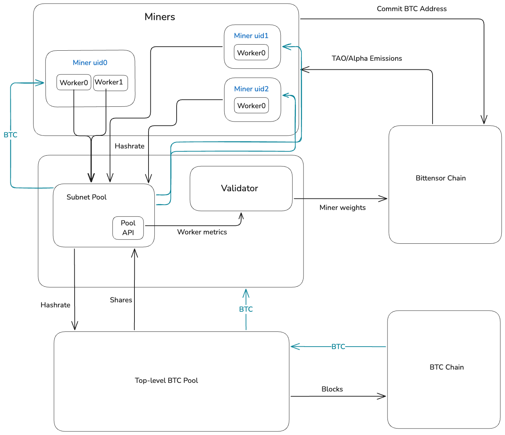

<div align="center">

# **TAO Hash** 
[](https://opensource.org/licenses/MIT)
[](https://deepwiki.com/latent-to/taohash)

</div>

TAO Hash is a Bittensor Subnet for incentivizing and decentralizing the production of proof-of-work (PoW) mining hashrate, rental and exchange. Validators receive hashrate from miners in exchange for issuing weights, while miners contribute hashrate and speculate on hashrate, hashprice and Alpha emissions. Effectively, Alpha is swapped for BTC hashrate automatically.

Although the initial implementation primarily supports Bitcoin mining via Braiins Pool, the architecture is designed to be extensible to other mineable projects with similar capabilities for verifying miner performance presicely and efficiently.

---
- [Incentive Design](#incentive-design)
- [Requirements](#requirements)
  - [Miner Requirements](#miner-requirements)
  - [Validator Requirements](#validator-requirements)
- [Installation](#installation)
  - [Common Setup](#common-setup)
  - [Miner Specific Setup](#miner-specific-setup)
  - [Validator Specific Setup](#validator-specific-setup)
- [Get Involved](#get-involved)
---

# Incentive Design
The core incentive mechanism aligns miners and validators through a market where hashrate is exchanged for on-chain rewards (Alpha). All miners contribute hashrate to a unified subnet pool, and validators evaluate miners based on the share value they generate rather than raw hashrate.



# Requirements

## Miner Requirements
To run a TaoHash miner, you will need:
- A Bittensor wallet
- Bitcoin mining hardware (ASICs, GPUs, etc.) OR access to remote hashrate
- Python 3.9 or higher
- Any BTC Miner software capable of pointing hashrate to a mining pool

### Optional (for advanced features):
- Redis server (for miner script persistence)
- Docker & Docker Compose (for proxy setup)
- Braiins Farm Proxy (for minimum difficulty and traffic routing)

## Validator Requirements
To run a TaoHash validator, you will need:
- A Bittensor wallet
- Subnet proxy credentials (provided by subnet staff)
- Python 3.9 or higher environment

# Installation

## Common Setup
These steps apply to both miners and validators:

1.  **Clone the repository:**
    ```bash
    git clone [https://github.com/latent-to/taohash.git](https://github.com/latent-to/taohash.git)
    cd taohash
    ```

2.  **Set up and activate a Python virtual environment:**
    ```bash
    python3 -m venv venv
    source venv/bin/activate
    ```

3.  **Upgrade pip:**
    ```bash
    pip install --upgrade pip
    ```

4.  **Install the TaoHash package:**
    ```bash
    pip install -e .
    ```

## Miner Specific Setup
After completing the common setup, the easiest way to start mining is:

### Quick Start (Direct Mining)
1. **Get Mining Pool Credentials**: Run the [`miner.py`](taohash/miner/miner.py) script to fetch your pool information:
   ```bash
   python taohash/miner/miner.py --subtensor.network finney --wallet.name WALLET_NAME --wallet.hotkey WALLET_HOTKEY
   ```
   This will display your unique worker credentials and pool connection details.

2. **Configure Your Miners**: Point your mining hardware directly to the subnet pool using the credentials from step 1.

3. **Monitor Your Performance**: Check your statistics at [https://taohash.com/leaderboard](https://taohash.com/leaderboard)

### Advanced Setup (Optional)
For features like minimum difficulty settings and advanced monitoring:
* [Set up Taohash Proxy](docs/running_miner.md#optional-proxy-setup)
* [Run the miner script for pool management](docs/running_miner.md#legacy-miner-script)

For complete details, see the [TaoHash Miner Setup Guide](docs/running_miner.md).

## Validator Specific Setup
After completing the common setup, follow the detailed steps in the Validator Guide:

* [Get subnet proxy credentials from the subnet staff](docs/running_validator.md#1-get-subnet-proxy-credentials)
* [Configure your validator (`.env` file)](docs/running_validator.md#4-configuration)
* [Run the validator (using PM2 recommended)](docs/running_validator.md#5-running-the-validator)

For the complete, step-by-step instructions for setting up and running your validator, please refer to the [TaoHash Validator Setup](docs/running_validator.md).

# Get Involved

- Join the discussion on the [Bittensor Discord](https://discord.com/invite/bittensor) in the Subnet 14 channels.
- Check out the [Bittensor Documentation](https://docs.bittensor.com/) for general information about running subnets and nodes.
- Contributions are welcome! See the repository's contribution guidelines for details.

---
**Full Guides:**
- [TaoHash Miner Setup Guide](docs/running_miner.md)
- [TaoHash Validator Setup](docs/running_validator.md) 
