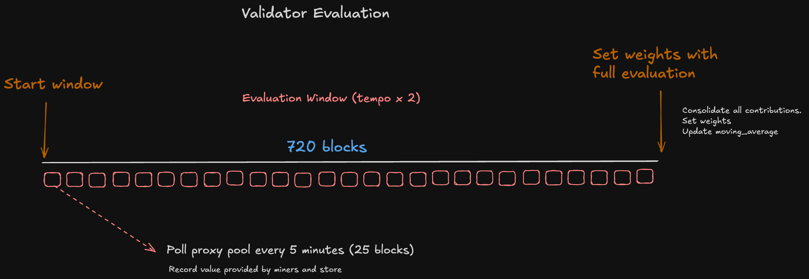

# TaoHash Validator Setup (BTC Braiins pool)

- [TaoHash Validator Setup (BTC Braiins pool)](#taohash-validator-setup-btc-braiins-pool)
  - [Prerequisites](#prerequisites)
  - [Setup Steps](#setup-steps)
    - [1. Braiins Pool Account Setup](#1-braiins-pool-account-setup)
    - [2. Bittensor Wallet Setup](#2-bittensor-wallet-setup)
    - [3. Running the Validator](#3-running-the-validator)
    - [4. Configuration Methods](#4-configuration-methods)
      - [Option A: Using a `.env` File (Recommended)](#option-a-using-a-env-file-recommended)
      - [Option B: Using Command-Line Arguments](#option-b-using-command-line-arguments)
    - [5. Running the Validator](#5-running-the-validator)
      - [Option A: Using PM2 (Recommended)](#option-a-using-pm2-recommended)
      - [Option B: Direct Python Execution](#option-b-direct-python-execution)
  - [Important Parameters](#important-parameters)
  - [Validator evaluation](#validator-evaluation)
  - [Troubleshooting](#troubleshooting)
  - [Security Notes](#security-notes)
  - [PM2 Management Guide](#pm2-management-guide)
    - [Process Management](#process-management)
  - [Support](#support)

This guide will walk you through setting up and running a TaoHash validator on the Bittensor network.

## Prerequisites

1. A Bittensor wallet
2. Braiins Pool account
3. Python environment (Python 3.8 or higher recommended)

## Setup Steps

### 1. Braiins Pool Account Setup

1. Create an account at [Braiins Pool](https://pool.braiins.com/signup/)
   - Enter your email address
   - Choose a username (this will be visible and used by miners)
   - Set a password
   - Confirm your email address

2. Get Mining Credentials
   - Navigate to [Mining Overview](https://pool.braiins.com/mining/overview/)
   - Click on "Connect Workers"
   - You will see your credentials in this format:
     ```
     userID: yourusername.workerName
     password: worker_password
     ```
   > Note: When using the credentials, only use your username without `.workerName`
   > ‼️ Note ‼️: This password IS NOT the same as the password to your account. It will be broadcast to the chain.

3. Generate API Access Token
   - Go to [Access Settings](https://pool.braiins.com/settings/access)
   - Click "Edit"
   - Enable "Allow access to APIs"
   - Click "Generate new token"
   - Copy and store your API token securely
   - Click "Edit Access Profile" to implement changes

### 2. Bittensor Wallet Setup

Ensure you have created a Bittensor wallet. If you haven't, you can create one using:
```bash
pip install bittensor-cli
btcli wallet create
```

### 3. Running the Validator

First, let's set up the repository and Python environment:

1. Clone the repository:
```bash
git clone https://github.com/latent-to/taohash.git
cd taohash
```

2. Set up Python virtual environment:
```bash
# Create virtual environment
python3 -m venv venv

# Activate virtual environment
source venv/bin/activate

# Upgrade pip
pip install --upgrade pip
```

3. Install the package:
```bash
pip install -e .
```

### 4. Configuration Methods

You have two ways to configure the validator:

#### Option A: Using a `.env` File (Recommended)

1. Create a `.env` file in the project root based on the provided example:
```bash
cd taohash/validator
cp .env.validator.example .env
```

2. Edit the `.env` file with your credentials:
```bash
nano .env
cd ../.. # Return to the root dir
```

This approach keeps your credentials secure and simplifies your command-line commands.

#### Option B: Using Command-Line Arguments

Use all required parameters directly in the command line (see "Important Parameters" section below).

### 5. Running the Validator

Now you have two options to run the validator: using PM2 for process management (recommended) or directly with Python.

#### Option A: Using PM2 (Recommended)

1. Install PM2:

   **On Linux**:
   ```bash
   sudo apt update && sudo apt install nodejs npm -y && sudo npm install pm2@latest -g && pm2 update
   ```

   **On macOS**:
   ```bash
   brew update && brew install node && npm install pm2@latest -g && pm2 update
   ```

   Verify installation:
   ```bash
   pm2 --version
   ```

   Setup PM2 startup script:
   ```bash
   pm2 startup
   ```

2. Start the validator with PM2:

   Using `.env` configuration:
   ```bash
   pm2 start python3 --name "taohash-validator" -- taohash/validator/taohash_validator.py run \
       --subtensor.network finney \
       --logging.info
   ```

   Or with command-line arguments:
   ```bash
   pm2 start python3 --name "taohash-validator" -- taohash/validator/taohash_validator.py run \
       --netuid 14 \
       --subtensor.network finney \
       --wallet.name YOUR_WALLET_NAME \
       --wallet.hotkey YOUR_HOTKEY \
       --pool.api_key YOUR_BRAIINS_API_KEY \
       --pool.username YOUR_BRAIINS_USERNAME \
       --pool.password YOUR_BRAIINS_WORKER_PASSWORD \
       --logging.info
   ```

#### Option B: Direct Python Execution

   Using `.env` configuration:
   ```bash
   python3 taohash/validator/taohash_validator.py run \
       --subtensor.network finney \
       --logging.info
   ```

   Or with command-line arguments:
   ```bash
   python3 taohash/validator/taohash_validator.py run \
       --netuid 14 \
       --subtensor.network finney \
       --wallet.name YOUR_WALLET_NAME \
       --wallet.hotkey YOUR_HOTKEY \
       --pool.api_key YOUR_BRAIINS_API_KEY \
       --pool.username YOUR_BRAIINS_USERNAME \
       --pool.password YOUR_BRAIINS_WORKER_PASSWORD \
       --logging.info
   ```

## Important Parameters

- `netuid`: Set to 14 for TaoHash subnet
- `subtensor.network`: Set to `finney` for mainnet
- `wallet.name`: Your Bittensor wallet name
- `wallet.hotkey`: Your wallet's hotkey
- `pool.api_key`: Your Braiins Pool API token
- `pool.username`: Your Braiins Pool username (without .workerName)
- `pool.password`: Your Braiins Worker password
- `logging.info`: Enables detailed logging

## Validator evaluation

1. Validators submit their evaluations every `blocks_per_weights_set`. Currently set at `2 * tempo`. 
2. They fetch, calculate, and store the hash value provided by miners every 5 minutes (25 blocks).
2. After setting weights, moving average is updated and scores are refreshed for next evaluation window. 



## Troubleshooting

If you encounter any issues:
1. Verify all credentials are correct
2. Ensure your wallet is properly set up and registered on the subnet
3. Check logs for detailed error messages
4. Make sure your Braiins Pool API access is properly configured

## Security Notes

- Never share your API keys or wallet credentials
- Store your API token securely

## PM2 Management Guide

### Process Management
```bash
# Save process list (ensures validator restarts on system reboot)
pm2 save

# Basic Commands
pm2 list                    # View all processes
pm2 monit                   # Monitor in real-time
pm2 logs taohash-validator  # View live logs
pm2 logs taohash-validator --lines 100  # View last 100 lines of logs
pm2 stop taohash-validator  # Stop validator
pm2 restart taohash-validator # Restart validator
pm2 delete taohash-validator # Remove from PM2

# Log management
# Install log rotation module
pm2 install pm2-logrotate

# Configure log rotation (optional)
pm2 set pm2-logrotate:max_size 10M
pm2 set pm2-logrotate:retain 7
```

## Support

If you need help, you can:
- Join the [Bittensor Discord](https://discord.com/invite/bittensor) and navigate to Subnet 14
- Check the TaoHash documentation
- To run on different environments, check out [Subnet tutorials](https://docs.bittensor.com/tutorials/basic-subnet-tutorials)